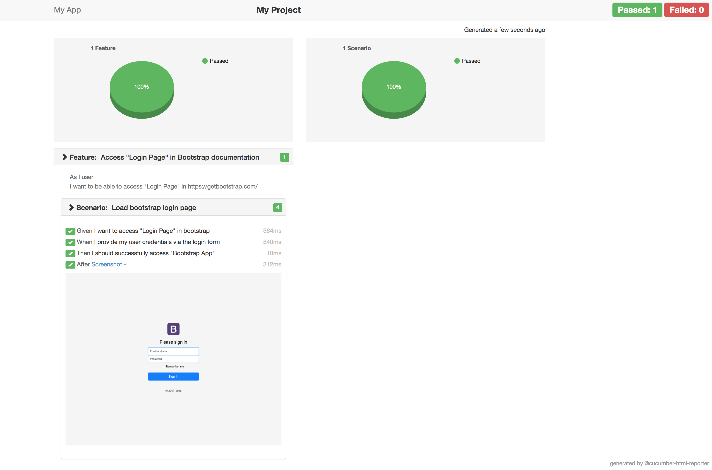

# e2e-puppeteer

e2e setup using puppeteer and cucumber for BDD.

Create .env file in root dir.

```env
APP_URL=http://getbootstrap.com/docs/4.1/examples/sign-in/
USER_EMAIL=john.doe@email.com
USER_PASSWORD=123456789
HEADLESS=true
VIEWPORT_WIDTH=1280
VIEWPORT_HEIGHT=1024
```

To run demo.

```shell
npm start e2e
```


